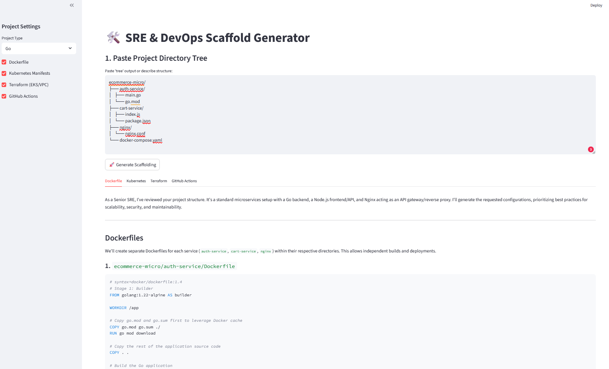

# 🛠️ SRE & DevOps Scaffolding Engine

An automated infrastructure-as-code (IaC) and containerization generator powered by **Google Gemini 2.5/3 Flash**. This tool transforms a project directory tree into production-ready SRE configurations.

## 🌟 Overview
Setting up the initial boilerplate for **Docker**, **Kubernetes**, and **Terraform** is often repetitive and error-prone. This tool leverages Generative AI to analyze project structures and generate context-aware configurations that follow SRE best practices.



## 🏗️ Tech Stack
- **Frontend:** [Streamlit](https://streamlit.io/) (Python-based Web UI)
- **AI Engine:** [Google GenAI SDK](https://github.com/googleapis/python-genai) (Gemini 2.5 Flash)
- **Monitoring/Forensics:** Integrated system state snapshots (Local SRE Tooling)
- **Infrastructure:** Designed for AWS EKS & VPC modules

## 🚀 Features
- **Intelligent Analysis:** Detects project types (Go, Python, C++, Node.js) from the tree structure.
- **Context-Aware Dockerfiles:** Implements multi-stage builds and non-root users.
- **Kubernetes Manifests:** Generates Deployments, Services, and HPA (Horizontal Pod Autoscalers).
- **Terraform Automation:** Scaffolds EKS clusters and VPC networking using verified modules.
- **CI/CD Integration:** Generates GitHub Actions workflows for automated build/deploy.

## 🛠️ Installation & Setup

### 1. Prerequisites
- Python 3.10+
- A Google AI Studio API Key

### 2. Environment Setup
```bash
python3 -m venv venv
source venv/bin/activate
pip install streamlit google-genai psutil plyer

```

### 3. Run the Application

Set your API key and launch the Streamlit server:

```bash
export GOOGLE_API_KEY="your_api_key_here"
streamlit run generator.py

```

## 📂 Project Structure

```text
.
├── sre_generator.py   # Main Streamlit Application
├── sre_agent.py       # Local Process Monitor & Forensic Tool
├── app.log            # Sample application logs for testing
└── sre_snapshots/     # Directory for generated forensic reports

```

## 🛡️ SRE Best Practices Included

* **Resource Limits:** All K8s manifests include CPU/Memory requests and limits.
* **Security:** Dockerfiles utilize minimal base images (Alpine/Distroless).
* **Observability:** Scaffolds include placeholders for Prometheus annotations.

---

*Developed as part of an SRE automation prototype - 2026*